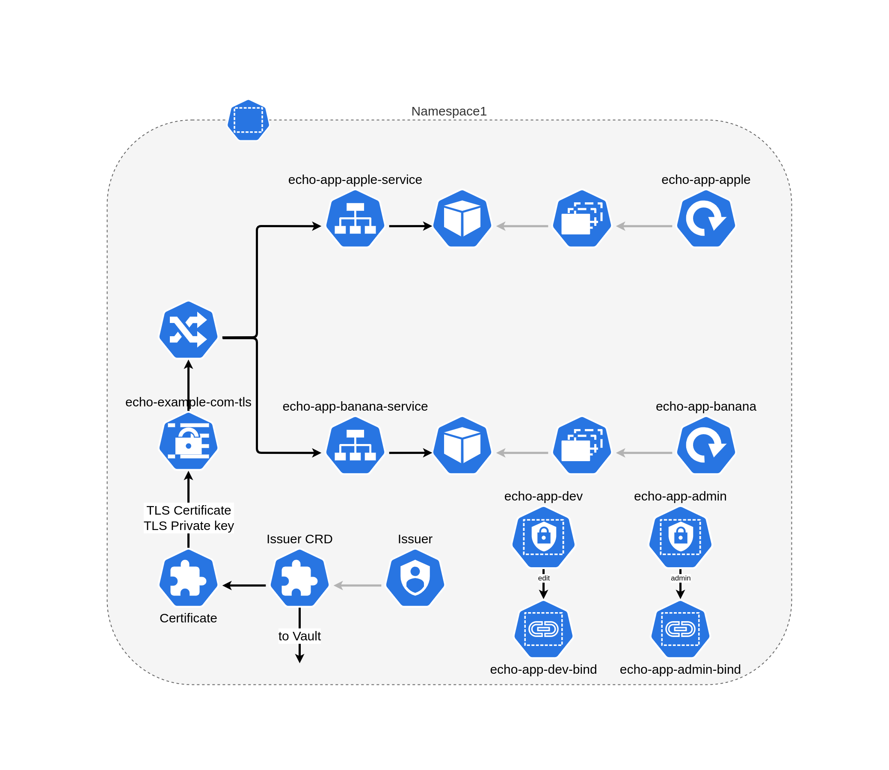

# Deploy HA k8s cluster with kubeadmin using ansible and vagrant

## Introduction

Deploy HA kubernetes cluster with 3 contol-plane nodes, 3 worker nodes and 2 GW nodes for external access to cluster using Vagrant

:warning: **This version work only with Ubuntu Server/Dekstop**

## Contents

1. [Requirements](#requirements)
   * [Host](#host)
   * [Ansible](#ansible)
   * [Vagrant](#vagrant)
2. [System Overview](#system-overview)
   * [Virtual Machines](#virtual-vachines)
   * [Kubernetes High Availability](#k8s-ha)
   * [LoadBalancer Service](#lb-service)
   * [Storage class](#storage-class)
   * [Example application](#example-app)
3. [Cluster installation](#cluster-install)
4. [Cluster Configuration](#cluster-config)
   * [Hosts](#hosts)
   * [Kubernetes](#k8s)
   * [Hashicorp Vault](#vault)
   * [Example Application Configuration](#example-app-config)

## Requirements

### Host

* 4 Processor core
* 16 GB of RAM

### Ansible

* [Ansible](https://docs.ansible.com/ansible/latest/installation_guide/intro_installation.html) verison **2.9** or newer
* [Ansible Collection Community.Kubernetes](https://docs.ansible.com/ansible/latest/collections/community/kubernetes/)
Install: `ansible-galaxy collection install community.kubernetes`
* [Ansible Collection Community.Crypto](https://docs.ansible.com/ansible/latest/collections/community/crypto/)
Install: `ansible-galaxy collection install community.crypto`

### Vagrant

* [Vagrant](https://www.vagrantup.com/docs/installation) version **2.2.14** or newer

## System Overview

### Virtual Machines

This cluster used only for education purpose.
:warning: DO NOT USE IN PRODUCTION

Cluster consist of 8 Virtual Machines

* 3 Control Plane nodes
* 3 Worker nodes
* 2 Gateway nodes

Control plane nodes doesn't allow any pods run on them except kubernetes contol plane pods. Gateway nodes use for NGINX ingress-controller pods deployment and also doesn't allow any other pods. Application pods and cluster service pods - such as Vault, Cert-Manager, Local-path-provisioner, EFK and Prometheus/Grafana, bare-metal load balancer provisioner runs only on worker nodes.

Gateway nodes needs an external load balancer ether for cluster administration and application access.

### Kubernetes High Availability

Each control plane node runs an instance of the kube-apiserver, kube-scheduler, and kube-controller-manager. The kube-apiserver is exposed to worker nodes using a load balancer.

From kubernets documentation:

> Each of master replicas will run the following components in the following mode:

> * etcd instance: all instances will be clustered together using consensus;

> * API server: each server will talk to local etcd - all API servers in the cluster will be available;

> * controllers, scheduler, and cluster auto-scaler: will use lease mechanism - only one instance of each of them will be active in the cluster;

> * add-on manager: each manager will work independently trying to keep add-ons in sync.

For load balancing workers access to control-plane we using **Kube-VIP**. The leader within the cluster will assume the **VIP** and will have it bound to the selected interface that is declared within the configuration. When the leader changes it will evacuate the **VIP** first or in failure scenarios the **VIP** will be directly assumed by the next elected leader. **Kube-VIP** deployed by static pods
This configuration provide failure toleration but not load balancing. For load balancing we deploy HAProxy server on all control-plane
nodes. HaProxy listen 0.0.0.0:8443 on contol-plane nodes and proxy request to kubernetes apiserver using round-robin algoritm.

### LoadBalancer Service

Kubernetes does not offer an implementation of network load-balancers (Services of type LoadBalancer) for bare metal clusters. The implementations of Network LB that Kubernetes does ship with are all glue code that calls out to various IaaS platforms (GCP, AWS, Azure…). If you’re not running on a supported IaaS platform (GCP, AWS, Azure…), LoadBalancers will remain in the “pending” state indefinitely when created.

Bare metal cluster operators are left with two lesser tools to bring user traffic into their clusters, “NodePort” and “externalIPs” services. Both of these options have significant downsides for production use, which makes bare metal clusters second class citizens in the Kubernetes ecosystem.

MetalLB aims to redress this imbalance by offering a Network LB implementation that integrates with standard network equipment, so that external services on bare metal clusters also “just work” as much as possible.

In this realisation Metallb work in Layer2 mode.

[MetalLB is a load-balancer implementation for bare metal Kubernetes clusters](https://metallb.universe.tf/)

### Storage class

[Local Path Provisioner](https://github.com/rancher/local-path-provisioner) provides a way for the Kubernetes users to utilize the local storage in each node. Based on the user configuration, the Local Path Provisioner will create hostPath based persistent volume on the node automatically. It utilizes the features introduced by **Kubernetes Local Persistent Volume** feature, but make it a simpler solution than the built-in local volume feature in Kubernetes. Currently the **Kubernetes Local Volume provisioner** cannot do dynamic provisioning for the local volumes.

With **Local Path Provisioner** we can create dynamic provisioning the volume using hostPath. We  dont have to create static persistent volume. **Local Path Provisioner** do all provisioning work for us.

### Example application

Example application is just two servers that return word *apple* and *banana* on GET request. In Kubernetes term application consist of 2 deployments(one for *apple* and one for *banana*), 1 replica per deployment. External access to application provided by NGINX ingress controller and ingress.

Access to *apple* app - `https://echo.example.com/apple`
Access to *banana* app - `https://echo.example.com/banana`
(A record in `/etc/hosts` file which matches IP address of LoadBalance service, provided by **Metallb** and hostname `echo.example.com`)

Certificate for encrypted HTTPS connection provided by Cert-manager, which use Hashicorp Vault as root Certificate Authority(CA). Certificate for ingress issued for 15 min(can be changed by `max_cert_ttl` variable) and automatically renewed by Vault. Cert-manager store certificate in kuberntes secret.

For application administration we create two users:

* `echo-app-admin` - bind to kubernetes `admin` role in application namespace scope
* `echo-app-dev` - bind to kubernetes `edit` role in application namespace scope

Access method to kubernetes apiserver is key/certificate.
All Private key, certificate for that users and kubectl config file stored in `~/.kube` folder on ansible executor host.

## Cluster installation

Configure `Vagrantfile` with your variable

| Name             | Default Value | Description                                                 |
|------------------|---------------|-------------------------------------------------------------|
|`k8s_master_num`  | 3             | number of control plane nodes                               |
|`k8s_worker_num`  | 3             | number of worker nodes                                      |
|`k8s_gw_num`      | 2             | number of gateway nodes                                     |
|`bridge`          | -             | Ethernet interface with internet access nodes connected to  |
|`vm_cidr`         | 192.168.1     | First 3 octets of nodes ip address                          |
|`vm_ip_addr_start`| 130           | Nodes start ip address last octet. Increase incremently     |

Create and start VM
`vagrant up`

Provision VM with ansible
`ansible-playbook -i inventories/k8s-ha-cluster/hosts.yml --ask-become-pass k8s-cluster-deploy.yml`

## Cluster Configuration

### Hosts

Change `ansible_host` variable in all files in `inventories/k8s-ha-cluster/host_vars` to ip address you choose in section *Cluster installation*. Private key and user generated by Vagrant and dont needed to be changed.

### Kubernetes

| Name                                   | Default Value | Description                                                 |
|----------------------------------------|---------------|-------------------------------------------------------------|
|`kubernetes_kubeproxy_mode`             | ipvs          | Which proxy mode to use: 'iptables' or 'ipvs'               |
|`kubernetes_apiserver_advertise_address`| -             | The IP address the API Server will advertise it's listening on. If not set the default network interface will be used.
|`kubernetes_cluster_domain_name`        |cluster.local  | Cluster domain name
|`kubernetes_cgroupDriver`               |systemd        | cgroup driver : 'systemd' or 'cgroup'
|`kubernetes_cri_socket`                 |/run/containerd/containerd.sock| CRI socket. In this realistion only container.d
|`kubernetes_cluster_name`               |kubernetes     | Cluster name

### Hashicorp Vault

| Name                                   | Default Value | Description                                                 |
|----------------------------------------|---------------|-------------------------------------------------------------|
|`root_ca_name`                          | "Demo Root Certificate Authority"| Name of CA
|`root_ca_cert_filename`                 | demo-root-ca  | CA parameters filename

### Example Application Configuration

| Name                                   | Default Value               | Description                                         |
|----------------------------------------|-----------------------------|-----------------------------------------------------|
|`chart_name_app`                        |echo-app                     | Helm release name for echo-app                      |
|`issuer_name`                           |echo.example.com-issuer      | Kubernetes cert-manager issuer CRD name             |
|`cert_name`                             |echo.example.com-cert        | Kubernetes cert-manager certificate CRD name        |
|`secret_name`                           |echo-example-com-tls         | Kubernetes secret name used by ingress              |
|`server_name`                           |echo.example.com             | A common name to be used in TLS Certificate         |
|`dns_server_name`                       |echo.example.com             | A list of DNS subjectAltNames to be set in the TLS Certificate|
|`pki_policy_name`                       |example-dot-com              | Vault pki policy name                               |
|`k8s_namespace`                         |namespace1                   | Application kubernetes namespace name               |
|`domain_name`                           |example.com                  | Domain name used for certificate generation         |
|`allow_subdomains`                      |true                         | Allow certificate generation for subdomains         |
|`max_cert_ttl`                          |15m                          | Maximum certificate ttl                             |
|`chart_name_users`                      |echo-app-users               | Helm release name for echo-app-users chart          |
|`k8s_users_namespace`                   |same as `k8s_namespace`      | Namespace for user access. Must be same as `k8s_namespace`|
|`users`                                 |- username: echo-app-admin default_role: admin - username: echo-app-dev default_role: edit                                                   | List of users. If bind to kubernetes default role set up `default role` field. If bind to custom role - provide `rolename` field instead|

TODO:

1. Set up monitioring usin kube-prometheus-stack
2. Set up logging using banzai-cloud EFK stack
3. Set up monitoring/loggint using Prometheus/Loki/Grafana stack
