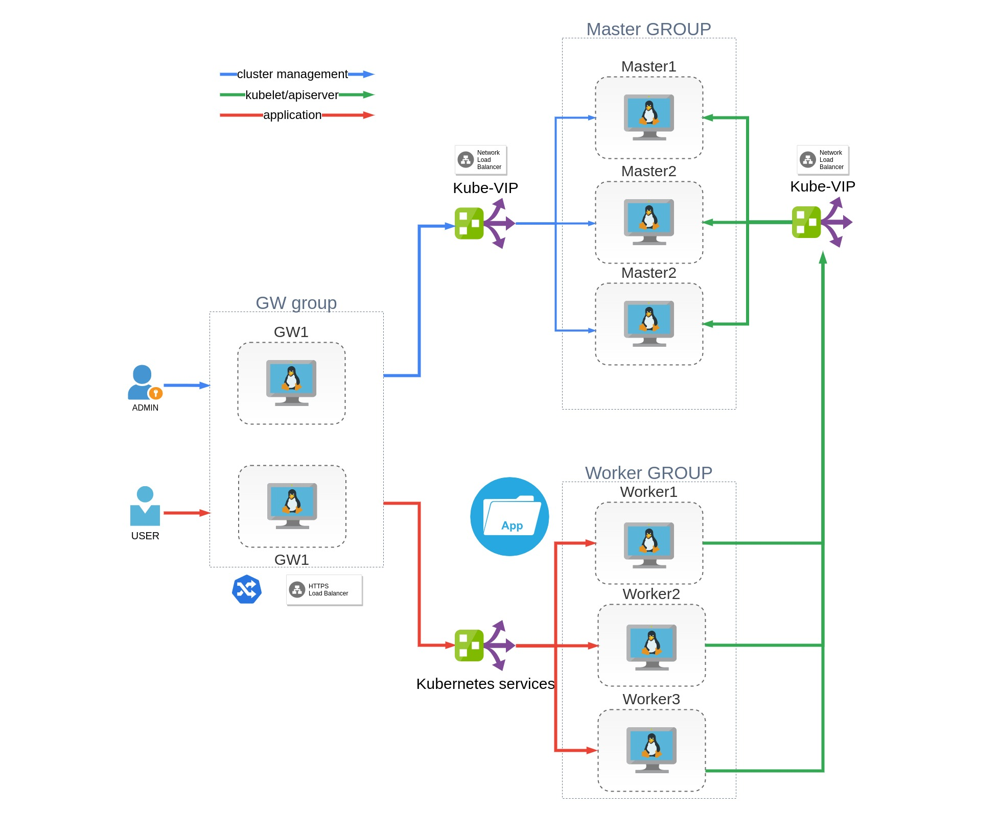

# Deploy HA k8s cluster with kubeadmin using ansible and vagrant

## Introduction

Deploy HA kubernetes cluster with 3 contol-plane nodes, 3 worker nodes and 2 GW nodes for external access to cluster using Vagrant

:warning: **This version work only with Ubuntu Server/Dekstop**

## Contents

1. [Requirements](#requirements)
   * [Host](#host)
   * [Ansible](#ansible)
   * [Docker](#docker)
3. [General principles](#general-principles)
   * [Configure](#configure)
   * [Deploy](#deploy)

## Requirements

### Host

* 4 Processor core
* 16 GB of RAM

### Ansible

* [Ansible](https://docs.ansible.com/ansible/latest/installation_guide/intro_installation.html) verison **2.9** or newer
* [Ansible Collection Community.Kubernetes](https://docs.ansible.com/ansible/latest/collections/community/kubernetes/)
To install it use: `ansible-galaxy collection install community.kubernetes`
* [Ansible Collection Community.Crypto](https://docs.ansible.com/ansible/latest/collections/community/crypto/)
To install it use: `ansible-galaxy collection install community.crypto`

## System Overview

This cluster used only for education purpose. 
:warning: DO NOT USE IN PRODUCTION

Cluster consist of 8 Virtual Machines
* 3 Control Plane nodes
* 3 Worker nodes
* 2 Gateway nodes

* Deploy 8 virtual machines with ubuntu 18.04 using vagrant

* Install k8s on VM - 3 node as master, 3 as worker using ansible roles, 2 as ingress node

* Use HAproxy to load balance k8s api-server

* Use kube-vip to create HA VIP for master node

* Use RBAC to restrict access to cluster

* Use 2 GW node to access k8s test application outside of cluster with Ingress
Deploy Ingress-nginx-controller as daemon set on gw1 and gw2. Deploy Metalllb. Create and deploy LoadBalancer type service connected to Ingress Daemon sets. Create deployment for 2 web services. Create 2 ClusterIP type services. Create Kind:Ingress which proxy external request to web services inside k8s cluster.

* Deploy Rancher Local Path Provisioner.

* Deploy Hashicorp Vault

* Deploy cert-manager

* Enable TLS connection with Ingress. Generate CA based on Vault and use cert-manager to renew certificate

* Create test web application deployment

Known issue:
1. Problem with kubeconfig after first master init. kubectl wait failed. Reason unknown
2. Other master init problem. ectd check failure due timeout. Reason unknow. Try to solve problem using kubectl wait
