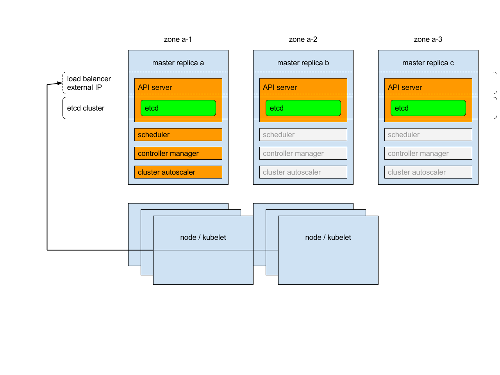
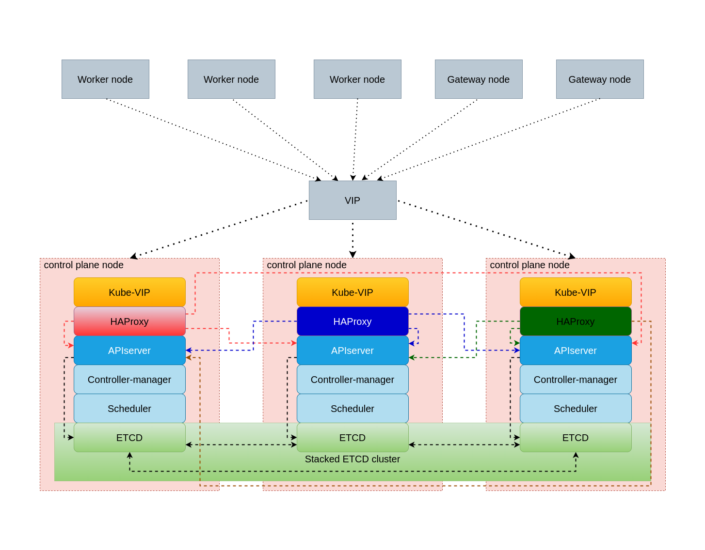

# Deploy HA k8s cluster with kubeadmin using ansible and vagrant

## Introduction

Deploy HA kubernetes cluster with 3 contol-plane nodes, 3 worker nodes and 2 GW nodes for external access to cluster using Vagrant

:warning: **This version work only with Ubuntu Server/Dekstop**

## Contents

1. [Requirements](#requirements)
   * [Host](#host)
   * [Ansible](#ansible)
   * [Docker](#docker)
2. [General principles](#general-principles)
   * [Configure](#configure)
   * [Deploy](#deploy)

## Requirements

### Host

* 4 Processor core
* 16 GB of RAM

### Ansible

* [Ansible](https://docs.ansible.com/ansible/latest/installation_guide/intro_installation.html) verison **2.9** or newer
* [Ansible Collection Community.Kubernetes](https://docs.ansible.com/ansible/latest/collections/community/kubernetes/)
Install: `ansible-galaxy collection install community.kubernetes`
* [Ansible Collection Community.Crypto](https://docs.ansible.com/ansible/latest/collections/community/crypto/)
Install: `ansible-galaxy collection install community.crypto`

### Vagrant

* [Vagrant](https://www.vagrantup.com/docs/installation) version **2.2.14** or newer

## System Overview

### Virtual Machines

This cluster used only for education purpose.
:warning: DO NOT USE IN PRODUCTION

Cluster consist of 8 Virtual Machines

* 3 Control Plane nodes
* 3 Worker nodes
* 2 Gateway nodes

Control plane nodes doesn't allow any pods run on them except kubernetes contol plane pods. Gateway nodes use for NGINX ingress-controller pods deployment and also doesn't allow any other pods. Application pods and cluster service pods - such as Vault, Cert-Manager, Local-path-provisioner, EFK and Prometheus/Grafana, bare-metal load balancer provisioner runs only on worker nodes.

Gateway nodes needs an external load balancer ether for cluster administration and application access.

### Kubernetes High Availability

Each control plane node runs an instance of the kube-apiserver, kube-scheduler, and kube-controller-manager. The kube-apiserver is exposed to worker nodes using a load balancer.

From kubernets documentation:

> Each of master replicas will run the following components in the following mode:

> * etcd instance: all instances will be clustered together using consensus;

> * API server: each server will talk to local etcd - all API servers in the cluster will be available;

> * controllers, scheduler, and cluster auto-scaler: will use lease mechanism - only one instance of each of them will be active in the cluster;

> * add-on manager: each manager will work independently trying to keep add-ons in sync.

For load balancing workers access to control-plane we using **Kube-VIP**. The leader within the cluster will assume the **VIP** and will have it bound to the selected interface that is declared within the configuration. When the leader changes it will evacuate the **VIP** first or in failure scenarios the **VIP** will be directly assumed by the next elected leader.
This configuration provide failure toleration but not load balancing. For load balancing we deploy HAProxy server on all control-plane
nodes. HaProxy listen 0.0.0.0:8443 on contol-plane nodes and proxy request to kubernetes apiserver using round-robin algoritm.

## Cluster installation

Configure `Vagrantfile` with your variable

| Name             | Default Value | Description                                                 |
|------------------|---------------|-------------------------------------------------------------|
|`k8s_master_num`  | 3             | number of control plane nodes                               |
|`k8s_worker_num`  | 3             | number of worker nodes                                      |
|`k8s_gw_num`      | 2             | number of gateway nodes                                     |
|`bridge`          | -             | Ethernet interface with internet access nodes connected to  |
|`vm_cidr`         | 192.168.1     | First 3 octets of nodes ip address                          |
|`vm_ip_addr_start`| 130           | Nodes start ip address last octet. Increase incremently     |

Create and start VM
`vagrant up`

Provision VM with ansible
`ansible-playbook -i inventories/k8s-ha-cluster/hosts.yml --ask-become-pass k8s-cluster-deploy.yml`

## Configuration

* Deploy 8 virtual machines with ubuntu 18.04 using vagrant

* Install k8s on VM - 3 node as master, 3 as worker using ansible roles, 2 as ingress node

* Use HAproxy to load balance k8s api-server

* Use kube-vip to create HA VIP for master node

* Use RBAC to restrict access to cluster

* Use 2 GW node to access k8s test application outside of cluster with Ingress

* Deploy Rancher Local Path Provisioner.

* Deploy Hashicorp Vault

* Deploy cert-manager

* Enable TLS connection with Ingress. Generate CA based on Vault and use cert-manager to renew certificate

* Create test web application deployment

Known issue:
